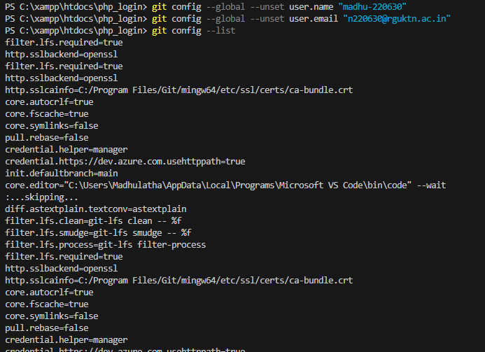
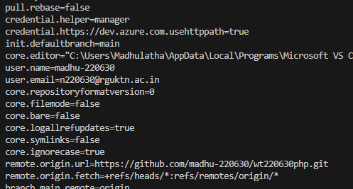
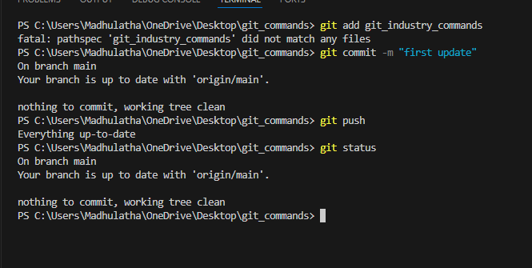
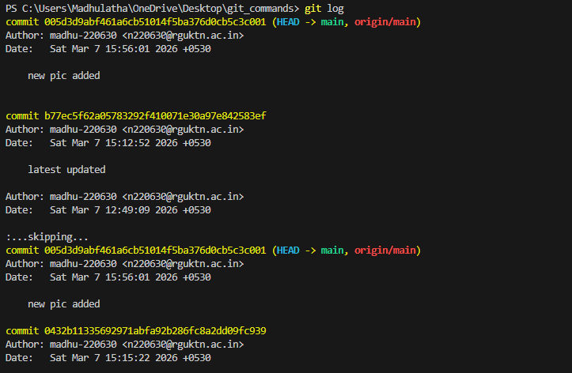
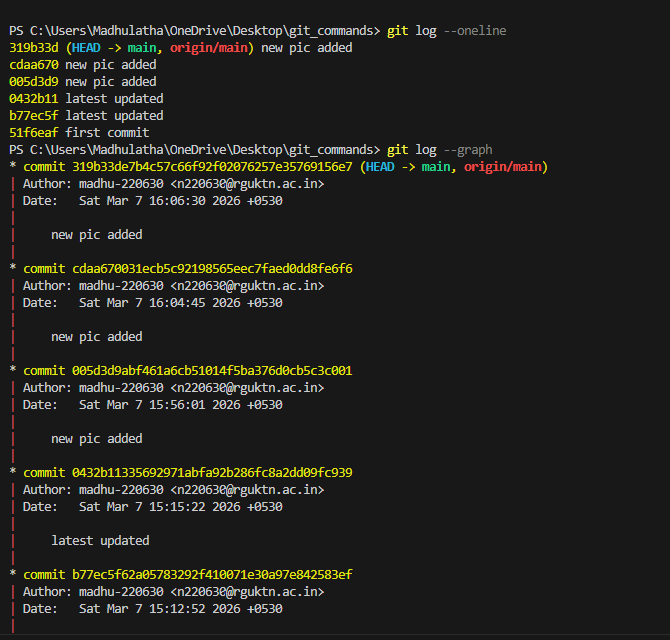
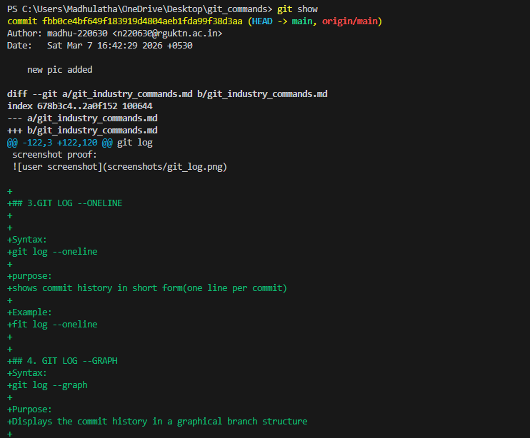
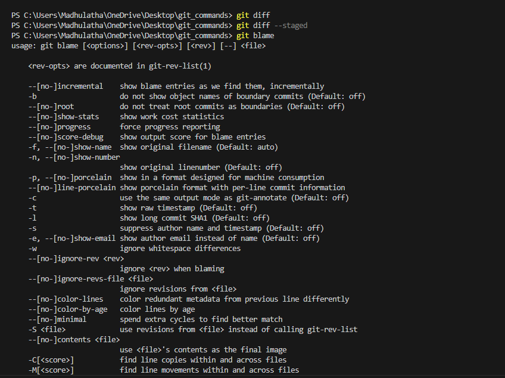
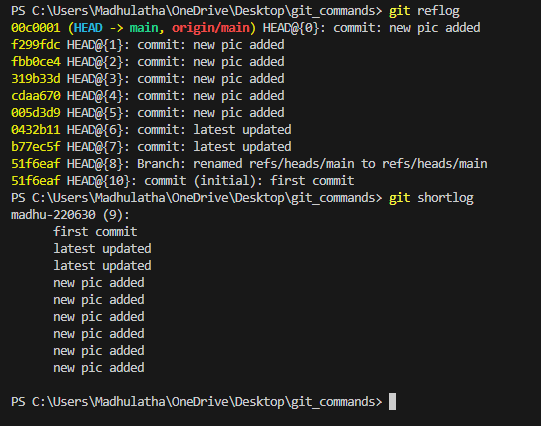

## 1.GIT CONFIGURATION COMMANDS

## 1.git config --user.name

Command name:
git config --user.name

Syntax:
git config --user.name "madhu-220630"

Purpose:
sets your git username globally.

Example:
git config --global user.name "madhu"

## 2.git config --user.email

Command name:
git config --user.email

Syntax:
git config --user.email "n220630@rguktn.ac.in"

Purpose:
Sets your git email globally.

Example:
git config --user.email "lathamadhu943@gmail.com"

## 3. git config --list

Command name:
git config --list

Syntax:
git config --list

Purpose:
Displays all Git configuration settings.

## 4. git config --unset user.name
Command name:
git config --unset 

Syntax:
git config --unset user.name "madhu-220630"

Purpose:
Removes a specific configuration name.

## 5.git config --unset user.email
Command:
fit config --unset user.email

screenshot proof:

Syntax:
fit config --unset user.email "n220630@rguktn.ac.in"

Purpose:
Removes a specific configuration email..

## git config --global user.name "madhu-220630"
## git config --global user.email "n220630@rguktn.ac.in"

screenshot proof:

## 3.REPOSITORY STATUS & INSPECTION

## 1. git status
syntax:
git status

purpose:

Shows the current status of your repository.
It tells:

Which files are modified

Which files are staged

Which files are untracked

example:
git status

screenshot proof:

## 2.GIT LOG

SYNTAX:
GIT LOG

purpose:
displays complete commit history of the repository.
It shows:
commit id
author name
date
commit message

Example:
git log

screenshot proof:

## 3.GIT LOG --ONELINE

Syntax:
git log --oneline

purpose:
shows commit history in short form(one line per commit)

Example:
fit log --oneline

## 4. GIT LOG --GRAPH
Syntax:
git log --graph

Purpose:
Displays the commit history in a graphical branch structure

Example:
git log --graph

Screenshot proof:

## 5.GIT SHOW

Syntax:
git show

Purpose:
shows detailed information about a specific commi,including:
author
date
commit message
code changes

Example:
git show 

Screenshot proof:

## 6.GIT DIFF
Syntax:
git diff

Purpose:
Shows a difference between modified files and the last commit 

Example:
git diff

## 7. GIT DIFF --STAGED
Syntax:
git diff --staged

Purpose:
Shows the difference between staged files and the last commit.

Example:
git dif --staged

## 8.GIT BLAME

Syntax:
git blame<file-name>

Purpose:
Shows who lst modofied each line in a file.

Example:
git blame<index.html>

Screenshot proof:

## 9.GIT REFLOG

Syntax:
git reflog

Purpose:
Shows all actions performed in the repository such as :
Commits
results
checkouts

Example:
git reflog

## 10. GIT SHORTLOG

Syntax:
git shortlog

Purpose:
Shows summary of commits grouped by author.

Example:
git shortlog

Screenshot proof:

